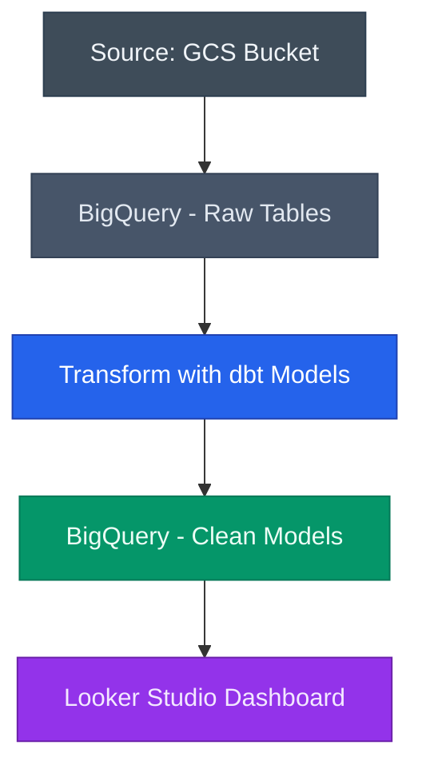

# Video Game Analytics Pipeline: GCS to BigQuery with dbt & Looker Studio

## Overview

This project showcases a modern data pipeline that processes Xbox and PlayStation gaming data to deliver insights on platform trends, genre popularity, and player engagement. Raw data is sourced from cloud storage, transformed using dbt in BigQuery, and visualized in a Looker Studio dashboard.

**Key Features**:
- **Data Integration:** Combines Xbox and PlayStation data across games, purchases, achievements, and pricing.
- **Cloud-Native Processing:** Uses Google Cloud Storage (GCS) and BigQuery to manage and analyze the data at scale.
- **SQL Transformations:** Applies modular data models using dbt for clean, reusable transformations.
- **Visualization:** A Looker Studio dashboard enables platform comparisons and insights into player behavior.

---

## Dataset and Scenario

The project uses gaming datasets stored as CSV files in Google Cloud Storage, including:
- Game metadata for Xbox and PlayStation
- Purchase records
- Price history
- Player achievements

### Transformation Goals:
1. **Average Library Size per User by Platform**
2. **Top Genres by Platform**
3. **Average Game Price by Platform**
4. **Achievement Breakdown by Game and Genre**

These models are built using dbt and served from BigQuery into Looker Studio for reporting and exploration.

---

## Architecture

Architecture Diagram

1. GCS stores raw source files  
2. BigQuery ingests raw tables  
3. dbt transforms raw tables into clean models  
4. Looker Studio connects to BigQuery for visualization

---

## Pipeline Workflow

1. **Upload Raw Files:** Upload raw CSVs to GCS.
2. **Data Loading:** Load data into raw BigQuery tables (via DAG or manually).
3. **Transform with dbt:** Run dbt models to transform and join datasets.
4. **Publish Views:** Publish clean models to BigQuery for dashboarding.
5. **Dashboarding:** Visualize insights in Looker Studio.

---

## Looker Studio Dashboard

The final dashboard includes:
- Genre distribution by platform
- Most popular games by achievements
- Player engagement comparisons
- Pricing trends across platforms

This dashboard highlights key behavioral patterns and platform differences.

---

## Installation Guide

### Prerequisites

- Google Cloud project with BigQuery and GCS enabled
- Service account key with access to BigQuery and GCS
- Docker and Docker Compose installed
- dbt CLI installed or used via container

### 1. Clone the Repository

Fork the repo and clone it locally:

git clone https://github.com/your-username/video-game-pipeline  
cd video-game-pipeline

### 2. Configure Your Environment

- Add your Google service account key to the root directory  
- Update profiles.yml to point to your BigQuery project and dataset  
- Ensure your CSVs are uploaded to your GCS bucket

### 3. Run dbt Models

Use the dbt CLI to run the models:

dbt build

Or trigger your Airflow DAG if using orchestration.

### 4. Launch the Dashboard

Go to Looker Studio and connect your views from BigQuery to create and explore insights.
